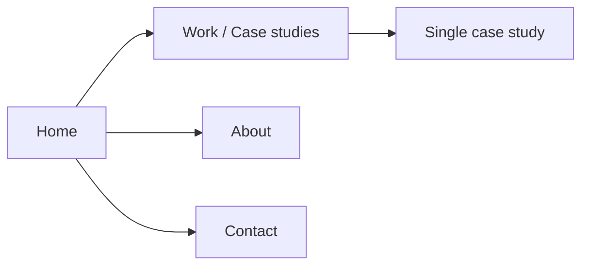

# Product Designer Portfolio — Build Plan

Use this as a living document: save as an `.md` file in your project folder and tick/edit sections as you progress. When you add inspiration screenshots, drop them into the **Inspiration & visual direction** section and refine the plan from there.

---

## 1. Best-practice standards (what to aim for)

Align the portfolio with what hiring managers and recruiters expect from product/UX designers:


| Principle               | Why it matters                                                                                        |
| ----------------------- | ----------------------------------------------------------------------------------------------------- |
| **Clear narrative**     | Each case study should tell a story: context → problem → process → solution → impact/learnings.       |
| **Scannable structure** | Headings, short paragraphs, and clear sections so readers can skim and dive where interested.         |
| **Outcome-focused**     | Lead with results (metrics, quotes, before/after) where possible; show impact, not only deliverables. |
| **3–5 strong projects** | Quality over quantity. Fewer, deeper case studies beat many thin ones.                                |
| **Fast and responsive** | Performance and mobile experience affect perception of your craft.                                    |
| **Accessible**          | Semantic HTML, contrast, focus states, and alt text show attention to inclusive design.               |
| **Simple navigation**   | Home, Work/Case studies, About, Contact (or combined About + Contact). No clutter.                    |
| **Personal voice**      | About page and case study intros should sound like you, not generic.                                  |


**Reference:** When you add inspiration screenshots, note which portfolios nail these (e.g. "Case study structure like X", "Navigation like Y") so your design system can reflect them.

---

## 2. Content: Markdown in repo (chosen approach)

**Case studies = Markdown files** in a `content/` (or `content/case-studies/`) folder. Each file has YAML frontmatter for metadata and Markdown for the body.

- **Edit in:** VS Code, Cursor, or any editor. No separate CMS or dashboard.
- **Best with:** Astro, 11ty, or Next.js (using `gray-matter` + `fs` or a layer like `contentlayer`).
- **Pros:** No setup, no accounts, no API limits; full version control and branching for content; works offline.
- **Workflow:** Add or edit a `.md` file → commit → site rebuilds on deploy (Vercel/Netlify).

---

## 3. Suggested tech stack

- **Site framework:** Next.js (App Router) or **Astro** (recommended for Markdown-heavy sites: built-in content collections, no extra deps).
- **Content:** Markdown files in repo (see section 2); parsed with Astro Content Collections, or with `gray-matter` / `contentlayer` in Next.js.
- **Styling:** Tailwind CSS (fast, consistent, easy to tweak from inspiration).
- **Hosting:** Vercel or Netlify (free tier); both build static output from Astro/Next and support instant rebuilds on Git push.
- **Domain:** Optional; start with `*.vercel.app` or `*.netlify.app`.

---

## 4. Information architecture (sitemap)

Keep the structure minimal and standard:




- **Home:** Short intro + featured or latest 2–3 case studies (cards with image, title, 1-line summary, link).
- **Work:** Grid or list of all case studies (from Markdown files); filter by type/client optional later.
- **Case study (template):** One page per project, content from Markdown frontmatter + body (see section 5).
- **About:** Photo, short bio, skills, tools, link to CV/Resume, optional "How I work".
- **Contact:** Email and/or Calendly/Typeform; optional simple form (e.g. Formspree or Vercel serverless).

---

## 5. Case study content model (Markdown frontmatter + body)

Every case study is one `.md` file. Use **frontmatter** for metadata and **body** for the main narrative (sections, images, outcomes). Filename = slug (e.g. `content/case-studies/mobile-banking-app.md` → `/work/mobile-banking-app`).

**Frontmatter (YAML):**

```yaml
title: "Project title"
tagline: "One-line summary for cards and meta"
client: "Client or context"        # optional
year: "2024"
role: "Lead product designer"
team: "With eng, research…"       # optional
featuredImage: "/images/work/project-hero.jpg"
link: "https://…"                 # optional, live product or prototype
metaDescription: "Short description for SEO"
```

**Body (Markdown):** Write sections with headings (`## Section name`), paragraphs, lists, and images. Use a consistent pattern, e.g.:

- `## Overview` → context and problem
- `## Process` or `## Research & design` → how you worked
- `## Solution` → key screens/flows and decisions
- `## Outcomes` → impact, metrics, or learnings

Images: store in `public/images/work/` and reference as ``. Optionally support captions via a short convention (e.g. `*Caption*` on the next line).

When you add inspiration screenshots, map them to this structure (e.g. "Hero like screenshot A", "Section layout like screenshot B") so the template stays aligned.

---

## 6. Inspiration and visual direction (add your screenshots here)

- **When you provide screenshots:** Paste or link them here and add short notes:
  - Layout (e.g. full-bleed hero, card grid, sectioned case study).
  - Typography (font pairings, sizes, hierarchy).
  - Color (palette, dark/light, accents).
  - Components (navigation, buttons, project cards, quote blocks).
- **Mood/keywords:** e.g. "Minimal", "Editorial", "Bold typography", "Lots of white space".
- **Do / Don't:** What you want to adopt vs avoid from each reference.

This section will drive your design system (Tailwind theme, components, and case study template).

---

## 7. Implementation phases (checklist)

Use these as a running checklist; reorder or split as needed.

**Phase 1 — Setup and content model**

- Create repo and install framework (Next.js or Astro) + Tailwind.
- Add `content/case-studies/` folder and (if using Astro) a content collection config/schema for case studies.
- Define frontmatter fields and create a case study template (see section 5); add a `README` in `content/` describing the frontmatter so you can copy-paste when adding new projects.
- Add 1–2 dummy case studies as `.md` files for development.

**Phase 2 — Core layout and design system**

- Apply inspiration: typography, colors, spacing (Tailwind theme).
- Build global layout: header, footer, navigation.
- Build reusable components: buttons, cards, section containers, image + caption.
- Ensure responsive behavior and basic accessibility (focus, contrast, semantics).

**Phase 3 — Pages**

- Home: hero + featured case study cards (data from Markdown: read all case studies, sort by date or `featured`, show 2–3).
- Work: list/grid of all case studies (read from `content/case-studies/*.md`).
- Case study template: dynamic route `[slug]` that loads the matching `.md` file, renders frontmatter + Markdown body (with a Markdown → React/Astro component renderer).
- About: static content (or one `content/about.md` if you prefer).
- Contact: link(s) and/or simple form.

**Phase 4 — Content and polish**

- Write and add real case studies as new `.md` files in `content/case-studies/`.
- Add meta tags, Open Graph, and favicon for sharing and SEO (use frontmatter `metaDescription` and `featuredImage` for OG).
- Performance: optimize images (next/image or Astro Image; keep assets in `public/` or use a small image pipeline).
- Cross-browser and device check; fix any a11y issues.

**Phase 5 — Launch**

- Connect repo to Vercel or Netlify; configure build and env if needed.
- Optional: custom domain and basic analytics (e.g. Vercel Analytics or Plausible).
- Share with a few people for feedback; iterate on content and layout.

---

## 8. File structure (Markdown-based)

**Astro example** (content collections live in `src/content/case-studies/`):

```
/src
  /content
    /case-studies
      *.md                 # one file per case study
  /pages
    index.astro            # Home
    work/index.astro       # Work list
    work/[slug].astro      # Case study (get entry by slug)
    about.astro
    contact.astro
  layout.astro
  /components
  /layouts
/public
  /images
    /work                  # case study images
  favicon.ico
```

**Next.js example** (read Markdown from `content/case-studies/` with `gray-matter` or `contentlayer`):

```
/app
  page.tsx
  /work/page.tsx
  /work/[slug]/page.tsx
  layout.tsx
/components
/content
  /case-studies
    *.md
  README.md               # frontmatter template + instructions
/public
  /images/work
```

---

## 9. Next steps (immediate)

1. **Save this plan** as something like `PORTFOLIO-PLAN.md` in a new folder (e.g. `portfolio` or `product-design-portfolio`).
2. **Choose framework:** Astro (simplest for Markdown + content collections) or Next.js (if you prefer its ecosystem).
3. **Add your inspiration screenshots** to section 6 and note layout/type/color/component decisions.
4. **Start Phase 1:** create the repo, install stack, add `content/case-studies/` and frontmatter template, add 1–2 dummy `.md` case studies.
5. **Iterate:** as you build, update the checklist and "Inspiration" section so the doc stays your single source of truth.

Once you have screenshots and a preferred stack (e.g. "Sanity + Next.js" or "Markdown + Astro"), you can refine this plan further (e.g. component list, exact Sanity schema, or Tailwind theme values) and then implement phase by phase.
